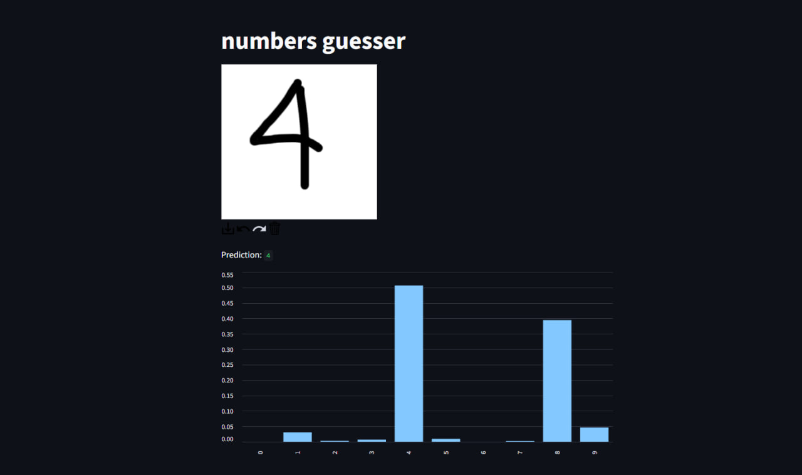

# Digit Recognizer

Draw a digit in the browser and let a neural network (trained on MNIST) guess what it is!

## Features
- Interactive drawing canvas
- Real-time digit prediction
- Probability chart for each digit

## Usage

1. Place `mnist_model.h5` (your trained Keras MNIST model) in the project folder.
2. Install dependencies:
    ```
    pip install -r requirements.txt
    ```
3. Run the app:
    ```
    streamlit run numbers_guesser.py
    ```

## Files

- `numbers_guesser.py` — main digit recognizer app
- `train_mnist.py` — script to train and save the MNIST model
- `mnist_model.h5` — trained MNIST model (not included)
- `requirements.txt` — dependencies

## Training the Model

To train your own MNIST model and save it as `mnist_model.h5`:

1. Open Google Colab and run `train_mnist.py` in it. 
2. Wait for model to train itself. Script will save the model as `mnist_model.h5` (look at Files section). 
3. Download it and load in `app.py`. 

## Example



## License

MIT